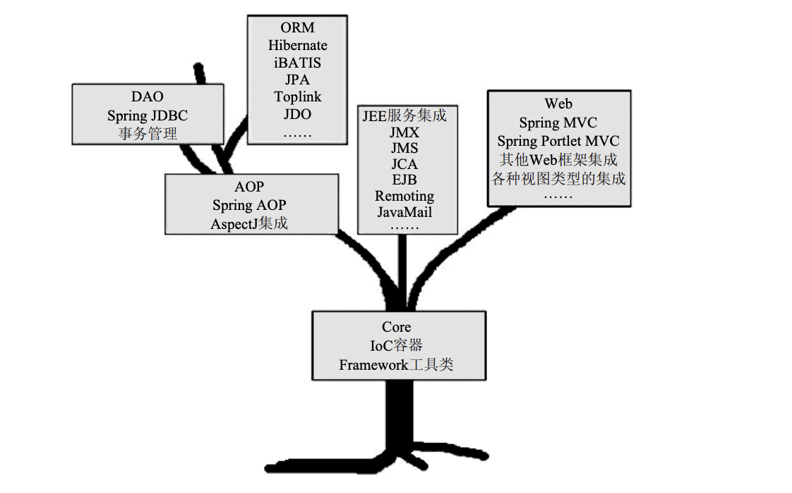

##前言

分布式架构

EJB被Spring革命了

事实上，当EJB被接受时，EJB沦为被过度推崇(狂热的氛围利于推广)。从而让EJB的缺陷很快暴露出来：笨重、复杂、不易测试,Entity Bean的失败；人们开始探索新的技术

Spring，风格是一切从实际出发，强调基于POJO的轻量级推进快速开发。先进的技术理念：IoC、AOP

##Spring框架的由来

EJB只是一种特定场景下的解决方案之一，没有一种解决方案是普遍使用的。脱离具体场景来讨论任何解决方案都是脱离实际的表现。

更具灵活性的一种设计，只需要一个大气层，围绕基础的POJO，只提供各种服务列表，不以绑定的死板形式出现，而是以可插拔的形式，按用户需要逐步添加，这样就能保持轻量级、灵活度。服务映射成具体的东西就是模块。

一棵树这样的生命必须依赖强大的根基才能生长繁盛。Spring框架内的各个模块，从横向来看，同一水平线下各个模块之间相互独立；纵向来看，上层的模块需要依赖下层的模块才能正常工作。

> 正像Donald J. Trump在How To Get Rich一书中所说 的那样：“Before the dream lifts you into the clouds, make sure look hard at the facts on the ground.”
>
> //cloud->很美好的感觉；ground->hard-》cloud是建立在groud之上的，cloud是groud的一部分

# IoC的基本概念

全名Inversion of Control ，这里的control意思就是指bean层面的东西，在inversion之前是用户要什么自己new, 反转之后是容器基于POJO准备好各种bean服务，需要什么给你准备什么。类似好莱坞原则“Don't call us, we will call you”

如果是以前，被注入对象与被依赖对象之间是直接依赖关系------体现在new 操作上；这种关系变动时影响成本很高；如果是IoC，被注入对象和被依赖对象通过IoC Service Provider来打交道，在这里是全部没对关系都交给Spring容器管理。被注入对象需要什么，只需要和IoC Service Provider打声招呼(体现在@Autowired 和 @bean注解的一些操作)，它就会把需要依赖的对象注入到被注入对象中。这体现了IoC Service Provider为被注入对象服务的目的。尤其是大工程，开发者越来越享受框架提供的这种服务，把对象的管理托管给容器，而不是开发者本身，减轻了开发者的负担。这是为什么框架得到广泛接纳的原因。

###2.2 IoC通过什么方式把依赖对象注入到被注入对象中：多种形式

###2.3 IoC带来的好处

* 本质就是解耦，接触业务对象之间的依赖关系的一种对象绑定方式
* 有了IoC，就可以当新增功能时，对原有代码的侵入性很小，复用相同业务逻辑
* 方便测试，当我们测试时并不是所有业务组件都要测试，往往我们只对个别几个有测试需要，有了IoC，我们可以拆出来需要的组件来测试。这建立在耦合度很低的程度。过去用new 维护的硬耦合的方式，很难拆出子业务组件。

## IoC Service Provider

1. 几个角色
   * 业务对象、客户端对象、IoC service provider、被注入对象、依赖对象
   * 

