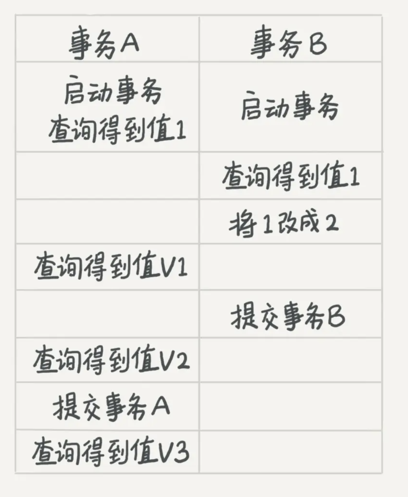
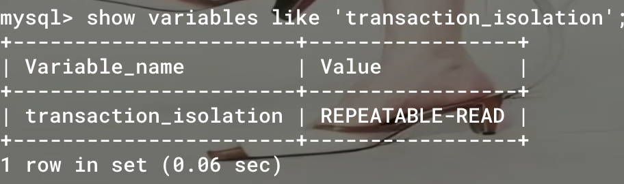

####第一课

```shell
#第一次相识
讲了一个针对学习mysql的学习理念：原理先行
		于此对比的是有充足经验和能力的人，时间的有效积累下还是被淘汰，这说明还不够。离开原理只是累积经验，成长速度还是不够快。而建立在原理基础上的经验才是加速器。
		理念：原理先行——》先找到最初的原理、原型——〉逐步演化，一直演化到最上层
```

一个观念，学会推理，之所以要掌握原理，是因为认识到细节无穷无尽，把细节当作方向，只会最终累死。所以掌握相对关键的，源头的部分，再加上推理，就能拿到八成原貌。

####第二课

1. 看的角度：从外到内，从大到小，从表及里，先有一个大概的认识

   * mysql 也是c/s的软件应用架构。client是用户接触的部分，server是实际执行提供功能的部分，<font color=#F00000>外加存储引擎层</font>

   * server 涉及了用户想应用的各种功能背后的服务设计，包括连接器、查询缓存、分析器、优化器、执行器

   * 存储引擎层涉及多种类型的存储引擎，不同的存储引擎涉及不同的数据存储方式

2. 一个查询流程，背后走了什么样的路径，发生了什么样的事？

   * client这个客人，要做什么事，在正题之前，先得试探、礼仪一下，这里涉及的第一个接待人是<font color=#F0100>连接器</font>：主要包括处理建立连接的事务、权限鉴权的事务(这里和很多地方的连接状态的设计大同小异，比如三次握手，这类，目的是连接手续)

     ```sql
     #连接命令
     mysql -h localhost -u root -p
     #经历tcp后，走连接认证逻辑，搜权限表，定下权限来
     #还涉及长连接和短连接的状态
     #为了避免频繁创建连接，建议使用长连接
     ```

     * <font color=#F00000>问题1:</font>长连接，长时间运行临时内存越来越大，会让mysql容易出现OOM，也就是异常重启，这个问题怎么解决？
       * 定期断开长连接，或者当执行一个占用内存特别大的操作时，就断开连接，下次用的时候再重连
       * mysql高版本，会有mysql_reset_connection来重新初始化连接资源，这种手段不需要重新创建连接状态，也不需要走权限验证逻辑，只是恢复到最开始的状态

   * 查询缓存，弊大于利，一般适用于静态表多的场景

   * 寒暄完之后，开始切入正题-<font color=#F00000>分析器</font>。先得弄清楚client说得是什么。这里设计词法分析、语法分析。词法分析是结构映射，啥是表，啥是列；语法分析，是一套检验规则，看看有没有错误==>弄清楚你要做什么事

   * 弄清楚要做什么，然后是怎么去做。这里是<font color=#f0000>优化器</font>。它做的是确定执行策略。比如存在索引的话，先走哪个索引，有表连接的话，选择连接的顺序

   * 前面都不涉及数据，前面把一些前奏的东西处理完，就开始实际执行了。也就是<font color= #f0000>执行器</font>,它涉及去表里实际拿数据

     * 在打开表数据前，会有权限验证的环节
     * 引擎接口提供读取数据的一行，满足就放进结果集
     * 慢查询rows_examined字段显示一个语句的执行扫描了多少行


####第三课

一张表的定义信息：什么定义一张表：首先得有个标识表的东西-表名；然后表的结构由字段维系的，字段自然有字段的标识信息，字段具体的数据的类型信息，如何操作字段的控制信息

更新操作绕不开的两个日志模块设计：

* 很多设计都能在生活历史中找到原型，软件也是。看不见的思路是不受表象限制的
* 粉板和账本的配合：先是够不够的问题，不仅限于粉板、也不仅限于账本，取决于这两个因素。这种东西在生活场景中用来解决赊账问题，赊账方式可以促进消费。而如果只有账本的话，随着数量越来越多，就会耗损很大成本在找到对应记录上。如果只有粉板更不行，因为粉板虽然擦除速度快，但容量有限，在忙的时候记录在粉板上，一天的量是有限的，在不忙的时候，然后记录在账本上。这样的中间-异步思路很好解决了矛盾问题。
* 类似，mysql也是如此场景。mysql的更新操作，实际上并不是每一条的改动都同步在磁盘上改动的，这里面就有一个类似粉板的设计，就是redo日志，涉及的技巧是WAL技术，在写之前先记日志。也就是发生更新操作时，先记录在日志上，然后更新内存，等到空闲时再更改磁盘
  * 引擎层的redo log设计：固定大小，通常可以配置具体文件数，没个文件的大小；两个指针，一个记录当前写的位置，一个是记录擦除的位置，整个是__循环写__的==》crash-safe能力
    * 总是说这个是物理的，其实针对的是页，记录的是页层面的改动
    * redo log 是InnoDB独有的，换了其他引擎，就没有了，引擎层操作的是这个log
    * 循环写，这个由两个指针的设计就能看出来
    * innodb_flush_log_at_trx_commit 参数设为1，每次事务都持久化磁盘
  * server层的bin log设计：
    * bin log 体现的是逻辑层面的记录，记录的是语义逻辑
    * server层面的执行器操作的是redo log
    * 追加写，写满了就换一个新文件，也就意味着这个没有固定大小
    * sync_binlog设置1，每次事务binlog 也持久化磁盘
  * 两阶段提交：redo log的prepare 和 commit状态
    * 引擎把更新操作记录在redo log，redo log 处于prepare状态—准备好提交事务的信号
    * 执行器调用引擎的提交事务接口，引擎把redo log改成commit状态
    * 在prepare和commit之间是执行器生成这个binlog，并写入磁盘
  * 某天下午2点发现到中午十二点的有一次误删表，需要找回数据，怎么做？
    * 先找到最近的一次全量备份，然后恢复到临时库
    * 找到备份的binlog，找到出问题的那个时刻
  * 为什么需要两阶段提交？为什么redo 和 bin 混在一起
    * 其实和事务的作用一样，主要是应对利用日志恢复数据的场景时，防止出现恢复出的不是原来数据的问题。如果先写redo log 后写bin log，在redo 完成后，bin写到一半，就crash了，mysql自己重启会按照redo来恢复，这个效果就是执行操作后的值；如果后续再有备份的需要时，利用bin 恢复时，bin没记录，所以会丢失一次更新==》redo bin 不一致对应 mysql 重启后的状态和备份后的状态不一致
    * 先写bin 后写 redo ，也是一个道理。只不过因为redo没记录，异常重启后没有状态；但是bin记录了，等到备份恢复时，就多了一次本来不应该存在的更新
  * 全量备份的周期策略，如何决定？是一周一备还是一天一备？
    * 一周一备，就得保证这一周内具体时间点的bin log都得完整，否则没法恢复，压力在bin log的写入的保证
      * 两个思考角度：最坏情况下的恢复目标时间
      * 考虑业务重要性和存储成本
    * 一天一备，相对要求这一天的binlog 完整，压力在备份的压力
  * 这个事务设计，在很多场景中都会用到

#### 第四课

在现实生活中，事务概念很重要。很多日常生活中的业务场景都需要事务概念支持。事务概念，简单来讲，就是一组操作，保证最后的状态要么是完全原点，要么是成功状态。只有这两种状态。对应操作上，要么是全部成功，要么全部回退。

事务并不是新的操作语句，而是一个防护罩，在原有的操作语句下，在外面套上了一层东西，主要考虑的并发之间的相互影响

事务支持是在引擎层实现的，但不是所有引擎都支持事务。

1. 事务涉及的相关概念

   * 事务的四个特性：ACID

     * 隔离性Isolation

       当事务出现并发执行时，就会带出并发问题，在数据库中常见的并发问题有：脏读dirty read、不可重复读 non-repeatable read、幻读 phantom read

       * 隔离级别的概念

         隔离的程度建立在牺牲效率的前提下，这里的隔离指事务之间相互影响的程度，确切地说事务各自处理的数据的相互影响程度

         * 四个隔离级别
           * 读未提交 read uncommitted
             * 两个事务混在一起，对数据的任何改变，对两个事务都是公开可见的
           * 读已提交 read committed
             * 一个事务对数据的变动，只有当它提交后，才对其他事务可见，否则就是他自己的可见域
           * 可重复读 reapetable read
             * 其他事务对数据的更改，对当前事务是没有干扰的。在这个级别下，每个事务开辟自己的小空间，其他事务对数据的变动无论是否提交，都看不到，自己操作的还是自己启动事务时看到的数据情况。只有自己提交事务后，才能看到公开域。不提交，自己的眼睛只能活在自己的可见域内
           * 串行化 serializable
             * 通过对一行记录加读写锁，来彻底隔离事务，不存在同一行数据在同一个时刻被多个事务操作，一女只侍一夫
         * 

两条并行的时间线，不同隔离级别约束下，能看到的V1、V2、V3各不相同

实现原理：

* 最初始的状态就是读未提交，这个时候没有任何额外的东西，每个事务对记录的修改都是透明的
* 然后是视图这个东西的创建点和事务启动时间点、sql语句执行点的先后顺序
  * 视图伴随事务启动创建，事务就会用这个视图----可重复读的效果
  * 视图在每个sql语句执行粒度创建---读提交隔离级别？？？？？待定

* 串行化，不是在数据上做手脚了，而是通过加锁来在访问上做手脚

如何配置隔离级别？改变启动参数transaction_isolation

2. MVCC多版本并发控制

   一条记录的修改，会伴随一个历史记录链，用来回滚时用-事务失败时就会回滚，到时🫴这个回滚日志来实现

   这时涉及一个问题，事务特别长，相应的回滚日志就特别大，在事务提交前，回滚记录必需保留，就会有占空间特别大的问题

3. 长事务带来的问题

    回滚段的影响、占用锁资源

    如何避免长事务？

   * 事务的启动方式

     * 如果是set autocommit = 0, 这个命令意思是关闭了自动提交，除非显式提交，否则所有操作都在事务中，自动启动事务
     * 建议使用set autocommit = 1, 启动和提交都显式，考虑交互次数，可以用commit work and chain来代替commit，这样提交后，会自动开启下一个事务

   * 排查长事务的命令
     ```sql
     -- 在information_schema库下innodb_trx表中，找事务持续时间>60s的记录
     select * from information_schema.innodb_trx where TIME_TO_SEC(timediff(now(),trx_started))>60
     ```

4. 如果你是负责人，如何处理长事务的情况，有没有什么方案？

* 应用开发端来看

  * 确认是否使用了set autocommit=0

    * 打开mysql的general_log日志，跑一个业务逻辑，通过这个日志确认这个值，然后改成1

    * ```sql
      -- general_log如何打开
      --先查看是否打开
      show variables like '%log%';
      -- 开启这个日志
      set global general_log = on;
      -- 查看这个日志
      -- general_log_file对应的就是日志存储地址
      ```

    * 

  * 确认是否有没有没必要的只读事务
  * 预估业务本身耗费时间，设置set max_execution_time命令控制每个语句执行的最长时间，避免单个语句执行最长时间

* 数据库端来看

  * 监控information_schema库下innodb_trx表，设置长事务阈值，超过就报警/或者kill

  * Percona的pt-kill这个工具不错，推荐使用

    ```shell
    #查杀会话
    pt-kill 工具用来查杀性能恶劣的各种会话
    ```

  * 业务功能测试阶段要求输出所有的general_log，分析日志行为提前发现问题

  * 5.6以上版本，，把innodb_undo_tablespaces设置成2，当大事务导致回滚段过大时，方便清理（？？？）-可能调节日志空间大小

####第五课、第六课

1. 理论

索引有利于提高数据查询效率，类似目录之于书。本质是借助索引查询的路径成本远短于没有任何技巧的查询

索引改变的是起点数据和终点数据的组织形式，但这只是一个模型特点，基于这种特点并不意味一种实现方式。相反，索引模型有很多种实现方式，基于不同读写效率，对应有不同的数据结构。

* 哈希结构

  * 完整的数据作为值存储在数组里，对完整数据做一个摘要，映射到数组索引，决定值存储的位置
  * 因为哈希映射并不具有传递单调性，所以添加随意添加，也就是不保证有序性，当做范围查询时，因为无法借助有序性，使用二分，所以只能暴力扫描，很慢==》基于这种特点，只适合等值查询

* 二叉搜索树

  * 本身结构带有顺序性，查询复杂度是Ologn, 当然越平衡，复杂度越趋近Ologn
  * 经过的路径节点数是log 叉数  2* 数据行数，以二叉树为例，100万行数据，因为路径要延伸就得不断去比对，所以要IO20个数据块，每个数据块IO时间10ms，一行数据就得需要200ms，不能接受==》考虑N叉树，比如InnoDB中N大概是1200，那么如果树高为4就能存储1200 的4次幂除以1200，大概17亿数据（liuyuboo中讲过这个特点，所以相对容易接受），最多4次IO

  * 也就是重操作集中在IO磁盘次数上了，谁能降低这个次数，谁就是更好的实现结构

2. 实战：InnoDB索引模型为例

   * InnoDB使用了B+树索引模型，每一个索引对应一颗B+树
   * 主键索引叶子结点存储的是，key: 主键值；value：整行数据
   * 非主键索引叶子结点存储的是，key:非主键值；value：对应的主键字段值
   * 通过主键查询，只涉及搜索一颗主键对应的树；通过普通索引查询，会先找普通索引对应树找到对应的主键字段值，然后回到主键索引对应的树，找到整行数据===》前者只涉及一棵树，后者两棵树，所以都可以是推荐使用主键索引
   * 索引维护
     * 对数据的增删，会带来索引树的变化，还涉及页分裂、页分裂带来的合并，这些都是性能影响区
     * 自增主键的好处，就是添加操作只会追加,系统会获取当前字段最大值加1作为下一条记录的ID值：建表命令==》在主键命令后面添加AUTO_INCREMENT
     * 问题：业务字段做主键索引还是自增主键做主键索引，如何取舍？
       * 因为非主键索引的叶子结点存储的是主键索引的字段值，如果主键索引采用的是空间占用量大的选择，就会造成占用空间大的问题，所以问题的关键在哪一种选择字段占用空间小
       * 如果是典型的kv场景，为了方便业务，也不存在什么其他索引，这个时候可以用业务字段作为索引

3. 运用索引规则，分析一条语句，扫描多少行

   * 案例1

     ```sql
     mysql> create table T (
     ID int primary key,
     k int NOT NULL DEFAULT 0, 
     s varchar(16) NOT NULL DEFAULT '',
     index k(k))
     engine=InnoDB;
     
     insert into T values(100,1, 'aa'),(200,2,'bb'),(300,3,'cc'),(500,5,'ee'),(600,6,'ff'),(700,7,'gg');
     -- 查询语句
     select * from T where k between 3 and 5
     ```

     * 先看where查询条件，因为k字段是索引，所以先去k索引树上找
       * between 3 在前，先找k=3的记录，找到叶子结点取得对应主键ID的值ID=3
         * 然后根据ID=3，因为查询*，所以去主键ID索引树上查整行数据R3
       * and 5 同理，先搜索普通K索引树得到主键ID信息，再拿着ID信息去查主键索引树
       * （两棵树叶子结点都是有序排序的，所以区间查询不需要把区间内的每行记录都扫一遍）
       * 继续在普通k索引树上查找，直到遇到不满足条件，结束

     结论：搜索了5次树，普通k索引树3次，主键索引树2次，回表过程2次

     * 优化角度1:怎么操作减少回表次数？（最根本的原则尽量减少访问资源）
       * 覆盖索引角度：因为select 要的结果是整行数据，所以要回表，如果只是搜索主键信息，就不需要回表，所以只搜索普通k索引树能提供的信息，就能满足——》这也叫覆盖索引 select ID（通过修改查询结果，只需要一颗普通索引树覆盖掉查询请求）
       * 联合索引角度：通过给查询条件字段和查询结果字段建立联合索引，也可以避免回表

     * 优化角度2:怎么减少索引个数？
       * 最左前缀原则：既适用于联合作引的最左n个字段，也适用普通单个文本索引的最左n个字符
         * 调整联合索引中字段顺序，来减少维护多余索引，也就是这个联合索引也能起单独索引的用处
         * 考虑字段空间大小，通过调整减少重字段索引的个数
       * 索引下推优化：多个查询条件，是在普通索引树判断一次，然后再回表在主键索引树判断一次--这个是5.6版本之前；6.6版本后，就可以在普通索引上同时做多个判断，这样减少了不必要的回表次数，直接在普通索引就过滤掉了——》把多个判断建立一个联合索引

4. 生产问题：

   ```sql
   -- 这样重建索引对不对
   alter table T drop primary key;
   alter table T add primary key(id);
   ```

   * 什么情况下有必要重建索引？
     * 考虑空间利用率，有时候删除数据后，表占用空间还是很大，可能是索引存在页分裂，页空洞，反正不够紧凑，这个时候就需要重建索引

```sql
alter table T engine=InnoDB
```


