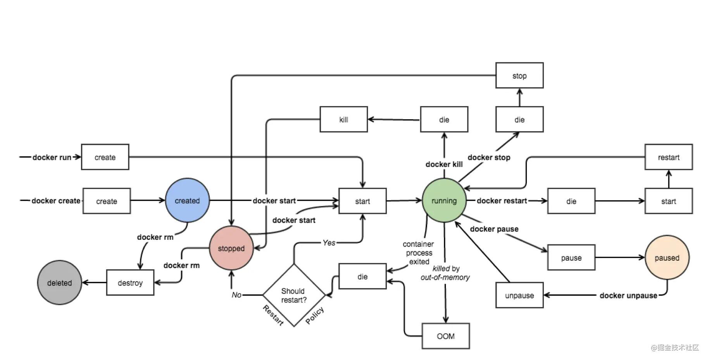
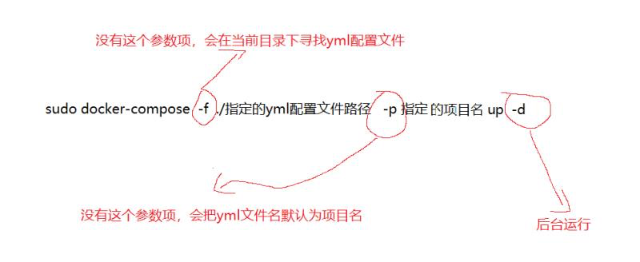

###### 基础概念

​		docker技术的基础是容器与虚拟化技术。 
​		虚拟化技术是指，对实体物理资源进行抽象，然后转换为虚拟资源来面向应用方 
​		容器技术是一种具体的虚拟化技术，指隔离的运行环境 
​		垫脚石：虚拟机产品——》减少了虚拟操作系统和虚拟监视器两个层次的感念 
​		

​		docker的实现底层： 
​				三大技术基础： 
​						命名空间namespace :将资源切割成虚拟独立空间，彼此隔离 
​						控制组 control groups：硬件资源分配 
​						联合文件系统 UFS 
​				四大组成对象： 
​						镜像images：只读的虚拟文件包，成层次的结构，每次更新时只会增加，不会更改 
​						容器container：一种活的空间 
​						网络network：通过restapi来网络通讯进而信息交互 
​						数据卷volume：文件目录挂载 
​				产品组成： 
​						dock er engine = docker daemon + CLI. ,c/s架构 

###### 镜像images

​		dock er镜像只允许自己打包，自己导出，自己下载。 
​		dock er每一个镜像信息，有全球唯一的64位hash码来标识 
​		镜像的命名逻辑：username （谁发布的）+ repository（软件名） + tag（版本号） 
​		镜像的生命周期： 
​				核心状态：created-- running--- passed--- stopped---deleted 

​				主进程与容器的关系： 
​						容器的兴衰和容器内pid编号为1的进程绑在一起的。所以推荐一个容器对应一个程序。这样容器关闭指令也会传到主进程停止。 
​				写时复制机制 
​						写时复制，比如两个数组拷贝，并非立即在内存中执行复制操作，而是先让新饮用指向旧内存空间上。等到旧引用发生修改时，再执行真正的复制操作。docker也是类似，docker启动初始化时，并非立即把镜像复制到沙盒环境，而是先把镜像挂到沙盒中。等容器涉及对文件修改时，才把修改体现到沙盒环境。这样就加快了启动速度 

###### 镜像仓库

​		仓库的价值：除了存储镜像，还有分发镜像，也就是可以供不同环境上传和拉取（事情变得简单，是因为把不简单的部分变得不可见就行） 
​		docker hub ：中央镜像仓库，默认仓库地址 

###### 配置镜像源

​		配置docker-engine的json文件：增加一行 registry mirrors

###### 容器网络配置

​		容器网络从大面讲就是，从真实的网络环境中，独立出一套自有的网络设备 
​		容器网络模型： 
​				沙盒 sandbox：包含了端口套接字、IP路由表、防火墙这些 
​				网络 network：虚拟子网 
​				端点 endpoint：出入口 
​		五种网络驱动： 
​				bridge driver(多)：网桥实现网络通讯 
​				host driver 
​				overlay driver(多)：借助集群模块docker. swarm来搭建 
​				maclan driver 
​				none driver 
​		容器互联：两个容器连接互动起来 
​				容器间的网络互通： 
​				暴露端口：在容器创建时 --expose  端口号 
​				别名来连接	 
​				

###### 端口映射

​		容器外通过网络访问容器中的应用？ 
​				一条命令，在创建容器时：-p 宿主机端口：容器端口 
​				非Linux平台：还要再搭一层映射，这个由desktop自动完成 

###### 数据存储、管理

​			背景：容器是隔离的，docker中文件如何做到与外界数据进行交互？uni o nFS文件系统，支持不同文件系统挂载在同一目录结构 
​			挂载方式：
​					bind mount: 把宿主的目录和文件挂到容器系统中 
​					volume：同样，由docker管理 
​					t mpfs mount : 挂载内存到文件系统 

###### 镜像生成、迁移

​		容器修改后，把沙盒环境持久化成一个镜像文件： 
​				指令：docker commit  原镜像名（类比git提交代码） 
​		为镜像命名：～  （-m 提交注释） 原镜像名 新镜像名 
​		把镜像输出到外部： 
​				docker save   -o  ./输出文件名.tar.  
​				或者：docker export -o  ./ 输出文件名.tar.  新镜像命名 
​		从外部导入镜像到容器： 
​				docker load  -i 外部文件名 
​				或者：docker import ./ 输出文件名.tar.  新镜像命名 

###### 基于镜像构建定义文件dockerfile 的镜像迁移(重点！！！)

​		docker file 简单体积小，所以在网络传输很快，所以方便容器迁移 
​		dockerfile 本质就是一个普通文本文件，但有一套自己独有的指令语法：注释行+指令行（指令+参数） 
​		docker file 实现了自动化构建环境体系，记录了完整的环境搭建流程逻辑 
​		docker file 相当于一个配置文件，docker会根据这个配置文件来构建镜像 

​		常见docker指令： 
​				很少从0开始构建镜像，而是在其他镜像基础上构建——》from指令引入其他镜像 
​				镜像构建需要借助控制台本身的指令——〉run指令 后接 其他指令 
​				容器启动，内部需要启动PID为1的进程——》entrypoint 和 cmd来实现 
​				在制作镜像时就暴露端口——〉expose指令 
​				需要持久化数据时——》volume指令 
​				引入外面的软件配置、程序脚本——〉copy 命令。add 命令 
​				根据dockerfile文件来构建镜像——》docker build  （-t  指定的镜像名称）file文件存放的目录   	

###### 如何自己更好设计dockerfile指令小tip？

​						需要频繁更改的变量，比如版本号，比如编译参数，为了避免频繁到文件内部更改——》用变量的形式来占位，然后指令中再指定变量具体值——〉ARG + 变量名，构建时 加上参数 --build-arg  变量名=具体值 

​						环境变量：arg类型的自定义变量只能在容器创建时影响，而env这种还可以影响运行过程。这种环境变量类似系统的环境变量设置。使用方式：ENV  变量名  变量值；占位方式：$变量名； 环境变量也可以在外面docker指令中覆盖利用参数 --env	 
​						合并命令：	因为每一条指令都意味着生成一层镜像，所以为了减少镜像层数量、减少镜像创建次数、提高镜像构建速度。 
​						构建缓存：还是为了提升镜像构建速度，已经有了就不用重新创建了。具体技巧：把容易变化的和轻易不变化的区分开；把不易变化的放到file前面；禁用时通过在指令后加参数 --no-cache	 
​						搭配entrypoint和cmd—具体看别人的写的范例来学用 

###### 如何使用docker hub中的镜像？

​		只要有外网，那么不从0开发才是工作选择，用别人的镜像来做；内网环境下，还是得自己写dockerfile
​		学会在dockerhub中，如何选择自己需要的镜像，如何识别tag;
​		学会识别dockerhub中怎么看配置说明来初始化
​		学会共享到dockerhub中自己的镜像

###### Docker compose 管理容器												

​		docker compose用来解决，复杂的容器互联、网络配置等问题，讲容器运行的环境固化下来，有利于快速切换环境
​		使用逻辑：
​				1.编写容器所需镜像的dockerfile
​				2.编写配置容器的docker-compose.yml
​				3.使用docker-compose命令启动应用
​		

​		docker-compose配置语法：
​				version：这个yml的版本
​				service：配置核心部分，主要是容器的细节

​		启动与停止：

​					停止：sudo docker-compose  down : 停止所有容器，消除所有配置
​		compose版其他命令：
​				查询日志信息---以前容器时针对单个容器：现在是针对服务名，直接找服务名
​				服务的启动活着停止---直接把docker替换成 docker - compose

###### yml文件的配置写法

​		指定镜像：有两种用法，一种是images，只能指定仓库中有的；一种是借助build，自己来生成
​		指定启动顺序：因为服务是有依赖的，而启动又不是严格从上到下，所以安排了一个属性 depends_on

###### docker常用指令

docker images   ——》查看本地所有镜像 
docker pull  镜像名 ——〉拉取指定镜像（不完全，就拉取最新版本） 
docker search  镜像名——》查看该镜像的所有版本 
Docker  inspect 镜像名——〉 查看镜像的详细信息 
docker  rmi  镜像名——》 删除指定镜像 
Docker info. ——〉查看docker信息 
Docker ps ——》查看dock er暴露的端口 
Docker network create  (-d 指定类型)——〉创建网络 
Docker network ls ——》查看已经存在的网络 
docker save  -o.  ./文件名.tar. ——〉镜像输出到外部
docker  load  -i  外部文件名.tar  ——》文件导入容器内部